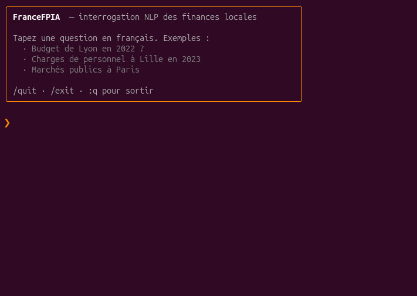
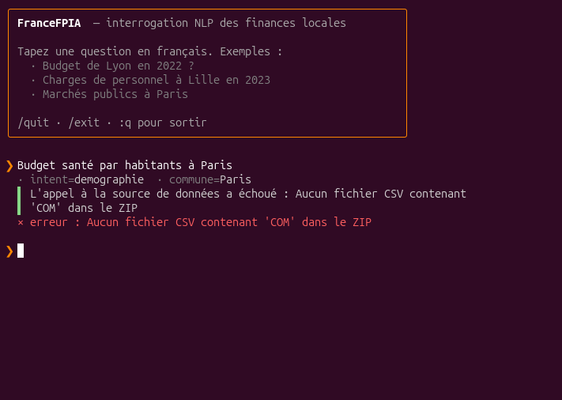
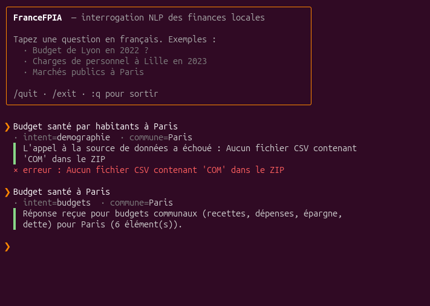

# CFFPIA

> **Communes de France Finances Publiques IA** — Extraction, structuration et interrogation en langage naturel des données financières des collectivités locales françaises.


---

## Présentation

CFFPIA agrège des données financières publiques issues de sources hétérogènes (data.gouv.fr, DGFiP, INSEE) dans une base PostgreSQL, les expose via une API REST Flask, et permet de les interroger en français depuis un CLI grâce à une pipeline NLP (détection d'intent + extraction d'entités + appel des scrapers).

---

## Données couvertes

| Jeu de données | Table | Ce que ça permet de savoir | Source |
|---|---|---|---|
| **Dépenses culturelles** | `depenses_culturelles` | Dépenses culturelles communales | Ministère de la Culture |
| **Budgets communaux** | `budgets_communes` | Recettes, dépenses, épargne, dette | DGFiP |
| **Balances comptables** | `balances_comptables_communes` | Soldes par poste comptable | DGFiP |
| **Subventions associations** | `subventions_associations` | Subventions versées aux associations | data.gouv.fr |
| **Marchés publics** | `marches_publics` | Contrats attribués par les collectivités | DECP |
| **Démographie** | `donnees_demographiques_communes` | Population et tranches d'âge | INSEE RP |
| **Revenus & pauvreté** | `indicateurs_revenus_communes` | Revenu médian, pauvreté, déciles | INSEE Filosofi |
| **Référentiel communes** | `communes` / `departements` | Noms, SIREN, code INSEE, département | geo.api.gouv.fr |

---

## Stack technique

| Tâche | Technologie |
|---|---|
| Collecte | Python (`requests`, `BeautifulSoup`, `feedparser`) |
| Base de données | PostgreSQL 14+ |
| ORM | SQLAlchemy 2 |
| API | Flask 3 |
| NLP | spaCy (PhraseMatcher, tokenizer français) + règles |
| CLI | Python stdlib (ANSI) + `requests` |
| Migrations | Alembic |

---

## Installation

### Prérequis

- Python 3.10+
- PostgreSQL 14+
- `pip` ou `uv`

### Mise en place

```bash
# Cloner le dépôt
git clone <url-du-depot>
cd francefpia

# Environnement virtuel
python -m venv .venv
source .venv/bin/activate

# Dépendances
pip install -r requirements.txt

# Variables d'environnement
cp .env.example .env
# Éditer .env (DATABASE_URL, SECRET_KEY)

# Base de données
flask db upgrade
```

### Variables d'environnement

```env
DATABASE_URL=postgresql://<user>:<password>@<host>:5432/<nom_db>
FLASK_ENV=development
SECRET_KEY=your-secret-key
```

---

## Structure du projet

```
francefpia/
├── app/
│   ├── __init__.py            # Factory Flask (create_app)
│   ├── models/
│   │   ├── referentiel.py     # Departement, Commune
│   │   ├── finance.py         # 7 modèles de données (budgets, balances, etc.)
│   │   └── journal.py         # Ingestion (journal de collecte)
│   ├── routes/
│   │   ├── data_gouv.py       # GET /api/<dataset> — consultation
│   │   ├── ingestion.py       # POST /api/ingest/<dataset> — déclencheurs
│   │   └── nlp.py             # POST /api/ask — interrogation NLP
│   ├── scrapers/
│   │   ├── data_gouv.py       # Fonctions de fetch (CSV, JSON, API, ZIP INSEE)
│   │   └── ingestion.py       # Pipeline fetch → parse → upsert + repair_commune_referentiel
│   └── nlp/
│       ├── entities.py        # Extraction (commune via PhraseMatcher, année/dépt regex)
│       ├── intents.py         # 7 intents + mapping vers les scrapers
│       ├── pipeline.py        # Orchestrateur question → dict de réponse
│       └── responder.py       # Génération de phrase (NLG template-based)
├── migrations/                # Scripts Alembic
├── tests/
├── cli.py                     # Terminal interactif stylisé
├── run.py                     # Point d'entrée Flask
├── requirements.txt
└── README.md
```

---

## Endpoints API

### Consultation

| Méthode | Route | Filtres |
|---|---|---|
| GET | `/api/depenses-culturelles` | `commune`, `departement` |
| GET | `/api/budgets` | `commune`, `departement`, `annee` |
| GET | `/api/balances` | `siren`, `commune`, `compte_prefix`, `annee` |
| GET | `/api/subventions` | `commune`, `beneficiaire`, `annee` |
| GET | `/api/marches` | `acheteur`, `annee`, `nature` |
| GET | `/api/demographie` | `code_insee`, `annee` |
| GET | `/api/revenus` | `code_insee`, `annee` |
| GET | `/api/datasets` | `q` (recherche data.gouv.fr) |

### Ingestion

| Méthode | Route | Paramètres |
|---|---|---|
| POST | `/api/ingest/depenses-culturelles` | — |
| POST | `/api/ingest/budgets` | `annee`, `max_records` |
| POST | `/api/ingest/balances` | `annee`, `max_records` |
| POST | `/api/ingest/subventions` | `annee`, `max_records` |
| POST | `/api/ingest/marches` | `annee`, `max_records` |
| POST | `/api/ingest/demographie` | `annee` (2018 / 2019 / 2020) |
| POST | `/api/ingest/revenus` | `annee` (2018 / 2019 / 2020) |
| GET | `/api/ingest/history` | `limit` |

### NLP

| Méthode | Route | Corps |
|---|---|---|
| POST | `/api/ask` | `{ "question": "..." }` → `{ intent, entities, params, data, answer }` |

---

## Pipeline NLP

L'endpoint `/api/ask` enchaîne quatre étapes (voir [app/nlp/pipeline.py](app/nlp/pipeline.py)) :

1. **Détection d'intent** ([intents.py](app/nlp/intents.py)) — mots-clés normalisés → un des 7 jeux de données.
2. **Extraction d'entités** ([entities.py](app/nlp/entities.py)) — commune via `PhraseMatcher` spaCy alimenté par la table `communes`, année et département via regex, poste comptable via lookup mots-clés.
3. **Mapping → scraper** — chaque intent fournit un builder qui transforme les entités en kwargs pour la fonction de fetch correspondante.
4. **Génération de réponse** ([responder.py](app/nlp/responder.py)) — phrase template-based résumant l'intent, le contexte et le nombre de résultats.

Exemples reconnus :

```
Budget de Lyon en 2022 ?               → intent=budgets,     commune=Lyon,    annee=2022
Charges de personnel à Lille en 2023   → intent=balances,    commune=Lille,   compte_prefix=64
Subventions à Marseille en 2023        → intent=subventions, commune=Marseille
Marchés publics à Paris                → intent=marches,     commune=Paris
Taux de pauvreté à Toulouse            → intent=revenus,     commune=Toulouse
Dépenses culturelles dans le 13        → intent=depenses_culturelles, departement=13
```

---

## Utilisation

### Démarrer l'API

```bash
flask run        # http://127.0.0.1:5000
# ou
python run.py
```

### Terminal interactif

```bash
python cli.py
```

Lance une boucle de questions/réponses stylisée — pose tes questions en français, l'API renvoie l'intent détecté, les entités extraites et un résumé du résultat. `/quit`, `/exit` ou `:q` pour sortir.

| Démarrage | Requête trop complexe | Requête simple |
|:---:|:---:|:---:|
|  |  |  |
| Le CLI ouvre sur une bannière listant des exemples de questions et les commandes de sortie. | « Budget santé par habitants à Paris » mélange deux concepts (budget + démographie) — la détection d'intent choisit `demographie` à cause du mot « habitants », et le scraper plante. | « Budget santé à Paris » est sans ambiguïté — intent `budgets`, commune `Paris`, réponse propre. |

> **Bon réflexe** — la pipeline est à base de règles (mots-clés), pas d'un LLM : elle marche d'autant mieux que la question est **courte et porte sur un seul concept à la fois**. En cas d'erreur ou d'intent mal deviné, simplifie la formulation et précise commune + année.

### Réparer le référentiel commune

Si les noms de communes en base sont incohérents (`nom == code_insee`) ou si des SIRENs manquent, `repair_commune_referentiel` ([app/scrapers/ingestion.py](app/scrapers/ingestion.py)) patche tout en un appel à `geo.api.gouv.fr` (~8 s pour 35 000 communes) :

```python
from app import create_app
from app.scrapers.ingestion import repair_commune_referentiel
with create_app().app_context():
    repair_commune_referentiel()
```

---

## Tests

Suite pytest centrée sur les parties pures (extraction d'entités, détection d'intent, responder, helpers CLI) et la pipeline avec les fetchers mockés — pas de dépendance à la base ni à data.gouv.fr, exécution en ~5 s.

```bash
python -m pytest tests/                       # toute la suite
python -m pytest tests/ -v                    # verbeux
python -m pytest tests/test_entities.py       # un seul fichier
python -m pytest tests/ -k departement        # filtre par nom de test
```

---

## Licence

MIT — Libre d'utilisation et de modification.
